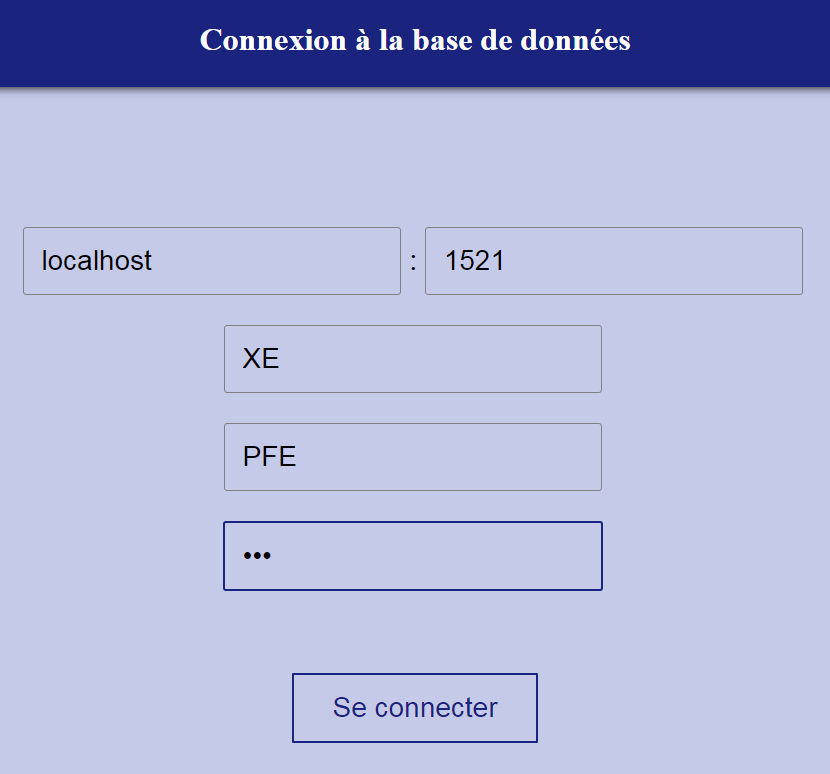
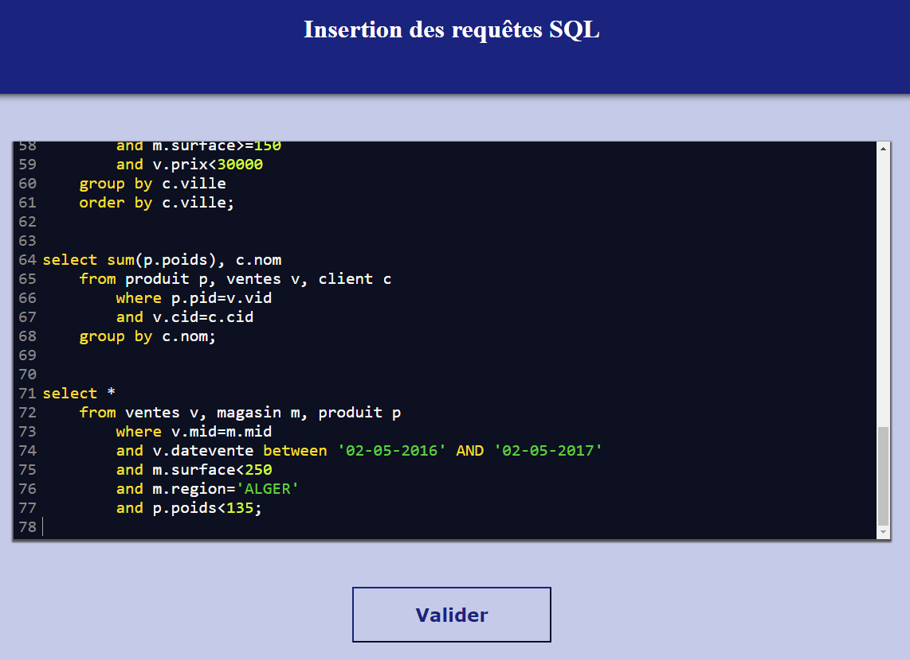
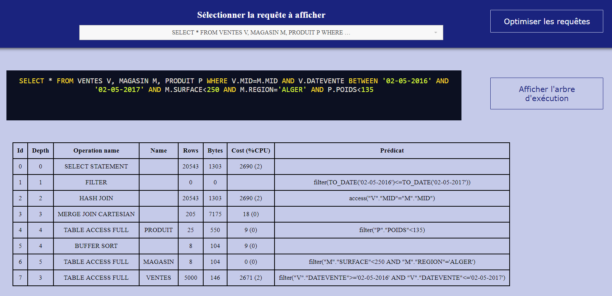
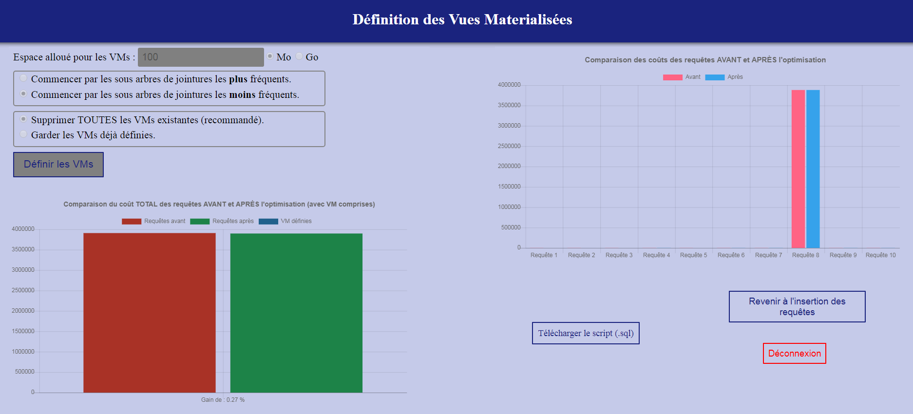

# Data Warehouse SQL Queries Optimizer
> A data warehouse is a structure which contains a large volume of data. Accessing this data is insured by queries which are generally very expensive in response time. The created optimizer is a website with a remote database connection which allows to reduce the cost of these queries, using a technique : materialized views.

## General info
Project released in **Mai 2018** as a graduation project for the License degree, field : *Information Systems Engineering and Software*. The goal was to design an online simulator to help administrators and database designers. More precisely, a tool for optimizing [star join](https://en.wikipedia.org/wiki/Star_schema) queries in [data warehouses](https://en.wikipedia.org/wiki/Data_warehouse) using [materialized views](https://en.wikipedia.org/wiki/Materialized_view).

## ScreenShots
<p align="center">
	<p align="center">
		
		
	</p>
	<p align="center">
		
	</p>
	<p align="center">
		
	</p>
</p>

## Project content
```text
.
├── examples			<- Contains a star schema database creation script and illustrations
│
├── src				<- Contains source-code of the project (organized following the MVC architecture)
│	├── Model		<- Defines the skeleton of the project (Classes and common functions)
│	│	├── Plugins	<- External libraries and used tools
│	│	└── Styles	<- CSS styles used in HTML and PHP generated pages
│	│
│	├── View		<- Contains the visible part (forms, diagrams and optimization results)
│	├── Control		<- Contains algorithms used to optimize SQL queries (the most important part)
│	└── index.php		<- The first page (login, connection to the database) of the optimization tool
│
├── licenseThesis.pdf	<- Final license thesis (in FRENCH)
└── README.md			<- Current project information
```
Note that most of comments and names of functions or variables are in ***French***

## Technologies
- Front-end development :
	- **HTML** and **CSS**.
	- **JavaScript** (with : [ChartJS](https://github.com/chartjs/Chart.js), [CodeMirror](https://github.com/codemirror/CodeMirror/), [HightLight](https://github.com/highlightjs/highlight.js), [JQuery](https://github.com/jquery/jquery), [OrgChart](https://github.com/caprica/jquery-orgchart) and [Selectric](https://github.com/lcdsantos/jQuery-Selectric)).
- Back-end development :
	- **PHP** (pure language, no frameworks or external libraries. Used version : *5.6*).
	- **SQL** (*Oracle Database*).

## Setup
To run this project, check that you have the necessary tools. Also, you need a local server (like [Apache](https://github.com/apache/httpd)). Then, configure [NAT](https://fr.wikipedia.org/wiki/Network_address_translation) and [port forwarding](https://en.wikipedia.org/wiki/Port_forwarding) in your modem/router for the remote connection and start the database listener `lsnrctl start`. Next, go to the ***src/*** directory and open ***index.php*** with your server.

## Examples
To use this tool, you must have a data warehouse with a star schema. To create a *"test user"* with such schema in your database, log-in with ***system*** and run ***examples/starSchemaDatabase. sql*** (see the illustration that explains the relationships of this database ***examples/databaseExplanation.png***). This will create and fill automatically a data warehouse using *PL/SQL* instructions), note that this may take a few minutes considering the large number of inserted tules.

The queries to optimize can be found in ***examples/starSchemaQueries.sql***, just copy-paste them in the *"SQL editor"* in *"SQL queries insertion"* phase.

Later, simply choose the options and start optimization.

## Features
- Connection to a database locally (*localhost*) or remotely.
- Viewing the plan and execution tree of a SQL query.
- Optimization using different parameters :
	- Specify the allocated space for the Materialized Views.
	- Start with the most (least) frequent joint sub-trees.
- Results in different forms :
	- Comparison of queries coast *before* and *after* the optimization
	- Download script containing defined MV's and rewritten SQL queries.

## Status
Since this optimizer was developed as a graduation project, it **will no longer be developed or improved**.
